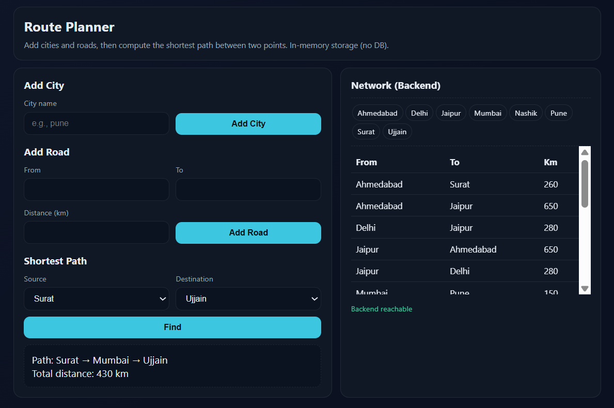

# Route Planner 🧭

### 🚀 Live Demo  
https://route-planner-production-9510.up.railway.app



A full-stack web application that allows users to add cities and roads, then compute the **shortest route** between any two points using **Dijkstra’s Algorithm**.

---

### ✨ Features
- Add unlimited cities dynamically
- Connect cities with roads & distances (km)
- Compute shortest route between any two connected cities
- Uses **Dijkstra’s Algorithm** internally
- Clean, modern UI built using HTML + CSS + JS
- Backend is powered by **Spring Boot REST APIs**
- Runs fully without a database (in-memory graph)

---

### 🧠 Tech Stack
| Layer | Technology |
|------|-------------|
| Backend | Java, Spring Boot, Maven |
| Frontend | HTML, CSS, JavaScript (Fetch API) |
| Deployment | Railway (Free Cloud Hosting) |

---

### 🚀 How to Run Locally

```bash
git clone https://github.com/kush86005/route-planner.git
cd route-planner
.\mvnw clean package -DskipTests
java -jar target/route-planner-0.0.1-SNAPSHOT.jar
